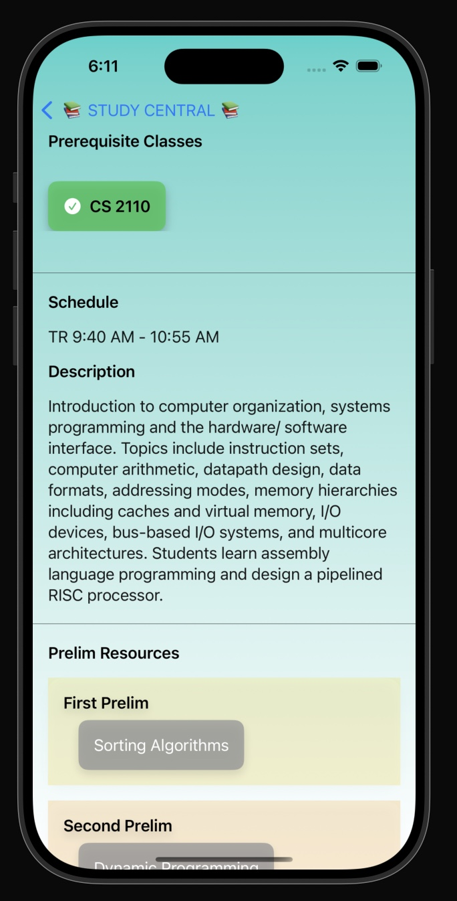
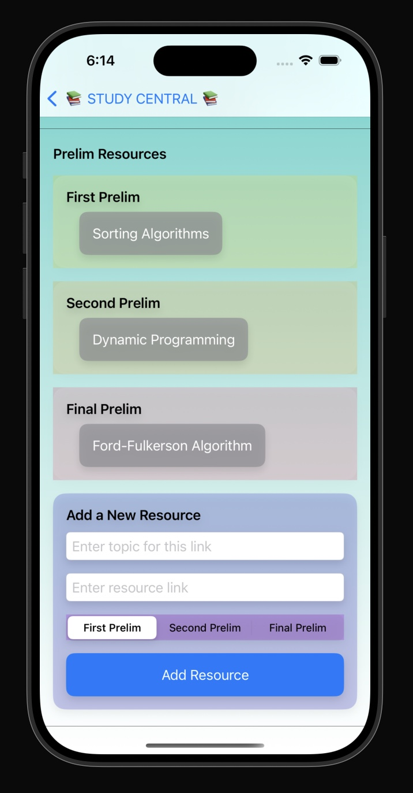

# StudyCentral
*A collaborative platform for Cornell students to share and access study resources for prelims.*

---

## Overview

**StudyCentral** is an open-source resource-sharing app designed for Cornell students to streamline their study preparations. It allows users to add topics and share resource links for each prelim in every course. The app fosters collaboration and provides centralized access to all study materials in an intuitive and easy-to-use interface.

The backend is built using **Flask (Python)**, while the frontend is developed in **XCode** using **Swift** for a seamless and user-friendly experience.

The backend is containerized using **Docker**, ensuring consistent deployment and simple setup across any environment. The app is currently deployed and accessible at:  
**[http://34.48.134.152/](http://34.48.134.152/)**

---

## Features

- **Course Management**: Create and view courses with detailed information, including descriptions, schedules, and prerequisites.
- **Prelim Tracker**: Add prelims associated with specific courses, complete with titles and dates.
- **Resource Sharing**: Add and view study topics along with resource links for each prelim.
- **Frontend Features**:  
  - Intuitive UI for managing courses, prelims, and resources.  
  - Mobile compatibility for on-the-go study planning.  
  - Easy navigation with dedicated sections for courses, prelims, and topics.  
- **Seamless API Functionality**: Offers a robust backend for managing courses, prelims, and topics through well-structured API routes.
- **Dockerized Backend**: Ensures portability, scalability, and ease of deployment.

---

## Screenshots

### Home Page


### Top of Course Page 


### Adding a Resource to each Prelim


---

## API Endpoints

### Course Management
- **`GET /api/courses/`**  
  Retrieve all courses.

- **`POST /api/courses/`**  
  Create a new course with details like name, description, and schedule.

- **`GET /api/courses/<int:course_id>/`**  
  Retrieve details of a specific course.

- **`DELETE /api/courses/<int:course_id>/`**  
  Delete a specific course.

### Prelim Management
- **`GET /api/prelims/`**  
  Retrieve all prelims across courses.

- **`POST /api/prelims/`**  
  Add a new prelim by specifying course ID, title, and date.

- **`GET /api/prelims/<int:prelim_id>/`**  
  Retrieve details of a specific prelim.

- **`DELETE /api/prelims/<int:prelim_id>/`**  
  Delete a specific prelim.

### Topic and Resource Sharing
- **`GET /api/topics/`**  
  Retrieve all topics and resources.

- **`POST /api/topics/`**  
  Add a new topic and resource link to a specific prelim.

- **`GET /api/topics/<int:topic_id>/`**  
  Retrieve details of a specific topic.

- **`DELETE /api/topics/<int:topic_id>/`**  
  Delete a specific topic.

---
## iOS Requirements
### Multiple screens
We had our main screen which displayed the different courses. Users were then able to click on a course, which took them to another screen with the detailed information like prereqs, course description, and all the different resources for each prelim, along with the option to add a topic and link for a certain prelim in the course.

### Scrollable Views 
We had a view with vertical scrolling that displayed all the courses. Then in each view with the detailed information we had a view with horizontal scrolling that displayed all resources for each prelim.

### Networking integration 
We fetched the courses from the backend. We also fetched the prelims for each course, which then had resources associated to that prelim. We also had a function where the user could post a new resource (topic and link) associated with a specific prelim.

---

## Backend Requirements
#### **1. Routes**

The backend provides the following endpoints categorized into **Courses**, **Prelims**, and **Topics**:

- **Home Route**:
  - **`GET /`**: A simple route to verify the server is running. Returns a "Hello, World!" message.

- **Course Routes**:
  - **`GET /api/courses/`**: Retrieves a list of all courses.
  - **`POST /api/courses/`**: Creates a new course with fields like name, description, schedule, and prerequisites.
  - **`GET /api/courses/<course_id>/`**: Retrieves details of a specific course by ID.
  - **`DELETE /api/courses/<course_id>/`**: Deletes a specific course by ID.

- **Prelim Routes**:
  - **`GET /api/prelims/`**: Retrieves a list of all prelims.
  - **`POST /api/prelims/`**: Creates a new prelim with fields like title, date, and the associated course ID.
  - **`GET /api/prelims/<course_id>/`**: Retrieves all prelims for a specific course by ID.
  - **`DELETE /api/prelims/<prelim_id>/`**: Deletes a specific prelim by ID.

- **Topic Routes**:
  - **`GET /api/topics/`**: Retrieves a list of all topics.
  - **`POST /api/topics/`**: Creates a new topic with fields like name, resource link, and associated prelim ID.
  - **`GET /api/topics/<prelim_id>/`**: Retrieves all topics associated with a specific prelim ID.
  - **`DELETE /api/topics/<topic_id>/`**: Deletes a specific topic by ID.
  - **`GET /api/topics/prelims/<course_id>`**: Retrieves all topics for prelims within a specific course.

---

#### **2. Database Models**

The backend uses **SQLAlchemy** as the ORM for database management. The models include:

- **Course**:
  - Represents a course.
  - Fields: `id`, `name`, `description`, `schedule`, `prerequisites`.
  - Relationships: A course can have multiple prelims (one-to-many relationship).

- **Prelim**:
  - Represents an exam (prelim) associated with a course.
  - Fields: `id`, `title`, `date`, `course_id`.
  - Relationships:
    - Belongs to a course (many-to-one).
    - Can have multiple topics (many-to-many relationship).

- **Topic**:
  - Represents a study topic, potentially linked to resources.
  - Fields: `id`, `name`, `resource_link`, `prelim_id`.
  - Relationships: Associated with multiple prelims (many-to-many relationship).

- **Join Tables**:
  - **`prelim_course`**: Links prelims to courses (many-to-many).
  - **`prelim_topic`**: Links prelims to topics (many-to-many).

---

#### **3. Database Configuration**

- **SQLite**:
  - Used as the database for simplicity and local development.
- **Flask-SQLAlchemy**:
  - Handles database interactions seamlessly.
- **Database Initialization**:
  - Automatic creation of tables using `db.create_all()`.

---

#### **4. Utility Functions**

- **`success_response(data, code)`**:
  - Standardized JSON responses for successful operations.
- **`failure_response(message, code)`**:
  - Standardized JSON responses for errors or failures.

---

#### **5. Scalability Considerations**

- **Relationships**:
  - The relationships between models (one-to-many, many-to-many) allow for easy expansion of features.
- **Cascade Deletions**:
  - Prelims and topics associated with a course are deleted automatically when the course is deleted.

---

#### **6. Frameworks and Libraries**

- **Flask**: Lightweight framework for building the API.
- **SQLAlchemy**: ORM for database modeling and interactions.
- **JSON**: Used for data exchange between the client and server.

---

#### **7. Additional Notes**

- The backend is currently standalone and does not integrate with third-party APIs.
- It’s designed to handle relationships between entities (courses, prelims, and topics) efficiently and allows CRUD operations for all entities.

## Technology Stack
- **Backend**: Flask (Python)
- **Database**: SQLite
- **Frontend**: XCode (Swift)
- **Containerization**: Docker
- **Hosting**: Google Cloud VM

---

## Contributors
Frontend: 
- Samantha Ahn, Ruby Penafiel-Gutierrez
  
Backend:
- Aleks Dzudzevic, Shannon Lin, Sandra Tang

---

## Setup Instructions

1. **Clone the repository:**

   ```bash
   git clone https://github.com/mcorgi/hackchallenge2024.git
   cd hackchallenge2024

2. Run the backend using Docker Compose:

   ```bash
   docker-compose up -d
  
3. Access the backend:
  - The backend will be available at: http://34.48.134.152/
    
### Frontend Setup (iOS)
4. Open the project folder in XCode (look for the .xcodeproj or .xcworkspace file).

- Update the backend URL in the iOS app’s configuration to http://34.48.134.152/.

5. Run the app:
- Select your target device or iOS simulator in XCode.
- Click the Run button to launch the app.
  
6. Access your app:
- Backend: http://34.48.134.152/
- Frontend: The iOS app running on the simulator or device.
   
   
